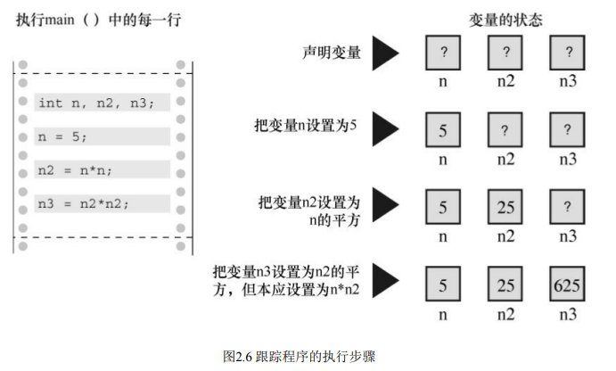

# C primer plus

## 1 初始C语言

### 1.1 使用C语言编程的7个步骤

数据存储在计算机中的实际形式是数字，每个字符都是一个数字码


c语言编程的7个步骤

- 定义程序的目标 
  
  - 明确自己目的 
  
  - 思考需要那些信息
  
  - 进行那些计算和控制
  
  - 程序应该报告什么信息

- 程序设计
  
  - 应该用一般术语来描述问题，而不是用具体的代码
  
  - 某些决策可能取决于语言的特性

- 编写代码
  
  - 把设计的程序翻译为c语言 
  
  - 注意添加文字注释

- 编译
  
  - C 编译器负责把C代码翻译成特定的机器语言
  
  - 编译器会检查C语言是否有效
  
  - 理解特定编译器报告的错误或警告信息

- 运行程序
  
  - 在IDE中运行
  
  - 点击生成的程序文件运行

- 测试和调试程序
  
  - 查找并修复程序错误的过程叫调试
  
  - 检查程序是否按照你所设计的思路运行

- 维护和修改程序
  
  - 想到了一个更好的解决方案
  
  - 想添加一个更好的新特性
  
  - 修改程序使其能在不同的计算机系统中运行

### 1.2链接器与编译器

- C语言编写程序时，编写的内容被储存在文本文件中，该文件被称为源代码文件

- 以.c结尾 在文件名中，点号（.）前面的部分称为基本名，点号后面的部分称为扩展名

- C实现通过编译和链接两个步骤来完成这一过程。编译器把源代码转换成中间代码，链接器把中间代码和其他代码合并，生成可执行文件。

- C 使用这种分而治之的方法方便对程序进行模块化，可以独立编译单独的模块，稍后再用链接器合并已编译的模块。通过这种方式，如果只更改某个模块，不必因此重新编译其他模块。

链接器的作用：将编写的代码 系统的标准启动代码 库代码 3部分合并成为可执行文件


### 1.3 unix系统

freesbsd是unix的一个分支

unix严格区分大小写，c程序文件后缀一定是小写c

UNIX C编译器要调用语言定义的cc命令令。但是，它没有跟上标准发展的脚步，已经退出了历史舞台。但是，UNIX系统提供的C编译器通常来自一些其他源，然后以cc命令作为编译器的别名。因此，虽然在不同的系统中会调用不同的编译器，但用户仍可以继续使用相同的命令。

如果要储存可执行文件（a.out），应该把它重命名。否则，该文件会被下一次编译程序时生成的新a.out文件替换。

如何处理目标代码？C 编译器会创建一个与源代码基本名相同的目标代码文件，但是其扩展名是.o 。在该例中，目标代码文件是 inform.o。然而，却找不到这个文件，因为一旦链接器生成了完整的可执行程序，就会将其删除。如果原始程序有多个源代码文件，则保留目标代码文件。学到后面多文件程序时，你会明白到这样做的好处。

在程序执行完毕后，执行程序的窗口立即消失。如果不希望出现这种情况，可以让程序暂停，直到按下Enter键，窗口才消失。要实现这种效果，可以在程序的最后（return这行代码之前）添加下面一行代码：

```c
getchar();
```

## 2 C语言概述

### 2.1 简单c程序示例

```c
#include <stdio.h>
int main(void) /* 一个简单的C程序 */
{
    int num; /* 定义一个名为num的变量 */
    num = 1; /* 为num赋一个值 */
    printf("I am a simple "); /* 使用printf()函数 */
    printf("computer.\n");
    printf("My favorite number is %d because it is first.\n",num);
    getchar()
    return 0;
}
```

```c
输出内容
I am a simple computer.
My favorite number is 1 because it is first
```

### 2.2 示例解释


#### 2.2.1 快速概要

stdio.h是C编译器软件包的标准部分，它提供键盘输入和屏幕输出的支持。

C程序包含一个或多个函数，它们是C程序的基本模块

圆括号表明main()是一个函数名。int表明main()函数返回一个整数，void表明main()不带任何参数

```c
#include<stdio.h> ←包含另一个文件
int main(void) ←函数名
/* 一个简单的C程序 */ ←注释
{ ←函数体开始
    int num; ←声明
    num = 1; ←赋值表达式语句
    printf("I am a simple "); ←调用一个函数
    printf("computer.\n"); ←调用另一个函数
    printf("My favorite number is %d because it is first.\n", num)
    return 0; ←return语句
} ←结束
```

printf()是标准的C库函数。在程序中使用函数叫作调用函数

#### 2.2.2 程序细节

##### 2.2.2.1 #include指令和头文件

include 的作用相当于把stdio.h文件中的所有内容都输入该行所在的位置。

#include这行代码是一条C预处理器指令

所有的C编译器软件包都提供stdio.h文件。该文件中包含了供编译器使用的输入和输出函数

**为何不内置输入和输出?**

并非所有的程序都会用到I/O（输入/输出）包。轻装上阵表现了C语言的哲学

__________

##### 2.2.2.2 main()函数

main是一个极其普通的名称，但是这是唯一的选择。C程序一定从main()函数开始执行（目前不必考虑例外的情况）

int是main()函数的返回类型

main() C90标准勉强接受这种形式，但是C99和C11标准不允许这样写

void main() 一些编译器允许这样写，但是所有的标准都未认可这种写法  最好采用标准写法

__________

##### 2.2.2.3 注释

被/* */两个符号括起来的部分是程序的注释

C99新增了另一种风格的注释  使用//符号创建注释，仅限于单行

______________

##### 2.2.2.4 花括号 函数体 块

一般而言，所有的C函数都使用花括号标记函数体的开始和结束。这是规定，不能省略。只有花括号{}能起这种作用，圆括号()和方括号[]都不行

____________________

##### 2.2.2.5 声明

int num；  这行代码叫作声明（declaration）

声明是C语言最重要的特性之一  完成两件事情：

- 在函数中有一个名为num的变量

- int表明num是一个整数

int是C语言的一个关键字（keyword），表示一种基本的C语言数据类型；关键字是语言定义的单词，不能做其他用途；**不能用int作为函数名和变量名。**  

num是一个标识符（identifier） 就一个变量

**变量： 函数或其他实体的名称**

C99和C11遵循C++的惯例，可以把声明放在块中的任何位置。尽管如此，首次使用变量之前一定要先声明它。

如果编译器支持这一新特性，可以这样编写下面的代码：

```c
int main() // 目前的C规则
{
// 一些语句
    int doors;
    doors = 5; // 第1次使用doors
    // 其他语句
    int dogs;
    dogs = 3; // 第1次使用dogs
    // 其他语句
}
```

为了与旧系统更好地兼容，本书沿用最初的规则（即，把变量声明都写在块的顶部）

______

##### 2.2.2.6 本章的一些问题

- 数据类型  C 语言可以处理多种类型的数据，如整数、字符和浮点数。把变量声明
  为整型或字符类型，计算机才能正确地储存、读取和解释数据。

- 命名  变量命名时要使用有意义的变量名或标识符

C99和C11允许使用更长的标识符名，但是编译器只识别前63个字符

可以用**小写字母、大写字母、数字和下划线（_）** 来命名

区分大小写 操作系统和C库经常使用以一个或两个下划线字符开始的标识符（如，_kcab），因此最好避免在自己的程序中使用这种名称。

*为了让C语言更加国际化，C99和C11根据通用字符名（即UCN）机制添加了扩展字符集。其中包含了除英文字母以外的部分字符。*

---

##### 2.2.2.7 赋值

num = 1;

赋值是C语言的基本操作之一。该行代码的意思是“把值1赋给变量num”

在执行int num;声明时，编译器在计算机内存中为变量num预留了空间，然后在执行这行赋值表达式语句时，把值储存在之前预留的位置

可以给num赋不同的值，这就是num之所以被称为变量（variable）的原因

---

##### 2.2.2.8 printf()函数

```c
printf("I am a simple ");
printf("computer.\n");
printf("My favorite number is %d because it is first.\n", num);
```

圆括号中的内容是从main()函数传递给printf()函数的信息

第1行把I am a simple传递给printf()函数。该信息被称为参数，或者更确切地说，是函数的实际参数（actual argument）

实际参数（简称实参）是传递给函数的**特定值**，形式参数（简称形参）是函数中用于**储存值的变量**

调用函数。只需输入函数名，把所需的参数填入圆括号即可

**printf()函数名中的f提醒用户**，这是一种格式化打印函数。printf()函数有多种打印变量的格式，包括小数和十六进制整数。

----

##### 2.2.2.9 return 语句

int main(void)中的int表明main()函数应返回一个整数。C标准要求main()这样做。有返回值的C函数要有return语句。

----

### 2.3 简单程序的结构

程序由一个或多个函数组成

必须有 main()函数

函数由函数头和函数体组成。函数头包括函数名、传入该函数的信息类型和函数的返回类型。通过函数名后的圆括号可识别出函数，圆括号里可能为空，可能有参数。

函数体被花括号括起来，由一系列语句、声明组成

如图2.4所示。本章的程序示例中有一条声明，声明了程序使用的变量名和类型。然后是一条赋值表达式语句，变量被赋给一个值。

接下来是3条printf()语句[4]，调用printf()函数3次。最后，main()以return语句结束。


### 2.4 提高程序可读性的技巧

- 有意义的函数名

- 写注释

- 在函数中用空行分隔概念上的多个部分 

*空行把声明部分和程序的其他部分区分开来。C语言并未规定一定要使用空行，但是多使用空行能提高程序的可读性*

- 每条语句各占一行

### 2.5 进一步使用c

```c
// fathm_ft.c -- 把2音寻转换成英寸

#include <stdio.h>

int main(void)
{
    int feet, fathoms;
    fathoms = 2;
    feet = 6 * fathoms;
    printf("There are %d feet in %d fathoms!\n", feet, fathoms);
    printf("Yes, I said %d feet!\n", 6 * fathoms);
    return 0;
}
```

程序在开始处有一条注释（使用新的注释风格），给出了文件名和程序的目的

程序在一条声明中声明了两个变量，而不是一个变量

用*表示乘法

新的方式使用printf()函数 

- 第1个printf()中进行了两次替换

- 待输出的变量列于双引号的后面。还要注意，变量之间要用逗号隔开。

- 第2个printf()函数说明待打印的值不一定是变量，只要可求值得出合适类型值的项即可，如6 *fathoms

### 2.6 多个函数

```c
//* two_func.c -- 一个文件中包含两个函数 */
#include <stdio.h>

void butler(void); /* ANSI/ISO C函数原型 */

int main(void)        
{
    printf("I will summon the butler function.\n");
    butler();
    printf("Yes. Bring me some tea and writeable DVDs.\n");
    return 0;
}

void butler(void) /* 函数定义开始 */
{
    printf("You rang, sir?\n");
}
```

butler()函数在程序中出现了3次。

- 第1次是**函数原型（prototype）**，告知编译器在程序中要使用该函数；

- 第 2 次以**函数调用（function call）** 的形式出现在 main()中；

- 最后一次出现在**函数定义（function definition）** 中，函数定义即是函数本身的源代码。下面逐一分析。

函数原型是一种声明形式，告知编译器正在使用某函数，因此函数原型**也被称为函数声明（function declaration）**。函数原型还**指明了函数的属性**。

例如，butler()函数原型中的第1个void表明，butler()函数没有返回值（通常，被调函数会向主调函数返回一个值，但是 bulter()函数没有）。第 2 个 void （butler(void)中的 void）的意思是 butler()函数不带参数。

因此，当编译器运行至此，会检查butler()是否使用得当。注意，void在这里的意思是“空的”，而不是“无效”。

早期的C语言支持一种更简单的函数声明，只需指定返回类型，不用描述参数：
void butler();
早期的C代码中的函数声明就类似上面这样，不是现在的函数原型。C90、C99 和C11 标准都承认旧版本的形式，但是也表明了会逐渐淘汰这种过时的写法

程序的最后部分是 butler()函数的定义，其形式和 main()相同，都包含函数头和用花括号括起来的函数体。函数头重述了函数原型的信息：bulter()不带任何参数，且没有返回值。如果使用老式编译器，请去掉圆括号中的void。

**何时执行 butler()函数取决于它在 main()中被调用的位置**，而不是 butler()的定义在文件中的位置。

C的惯例是把main()放在开头，因为它提供了程序的基本框架

**C标准建议，要为程序中用到的所有函数提供函数原型**。标准include文件（包含文件）为标准库函数提供可函数原型

### 2.7 调试程序

```c
/* nogood.c -- 有错误的程序 */
#include <stdio.h>
int main(void)
(
    int n, int n2, int n3;
    /* 该程序有多处错误
    n = 5;
    n2 = n * n;
    n3 = n2 * n2;
    printf("n = %d, n squared = %d, n cubed = %d\n", n,
    n2, n3)
    return 0;
)
```

```c
/* stillbad.c -- 修复了语法错误的程序 */
#include <stdio.h>
int main(void)
{
    int n, n2, n3;
    /* 该程序有一个语义错误 */
    n = 5;
    n2 = n * n;
    n3 = n2 * n2;
    printf("n = %d, n squared = %d, n cubed = %d\n", n, n2, n3);
    return 0;
}
```

n3 所求是n的四次方了



调试程序的三种方法

1. 通过逐步跟踪程序的执行步骤，并记录每个变量
   
   当循环过多工作量太大不适用 可以跟踪小部分看是否符合预期

2. 在程序中的关键点插入额外的 printf()语句，以监视制定变量值的变化

3. 使用调试器。调试器（debugger）是一种程序，让你一步一步运行另一个程序，并检查该程序变量的值。

### 2.8 关键字

粗体表示的是C90标准新增的关键字，斜体表示的C99标准新增的关键字，粗斜体表示的是C11标准新增的关键字


----


## 3 数据和C


